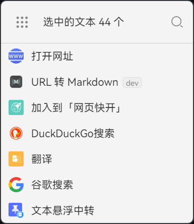
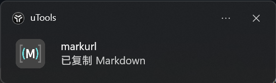
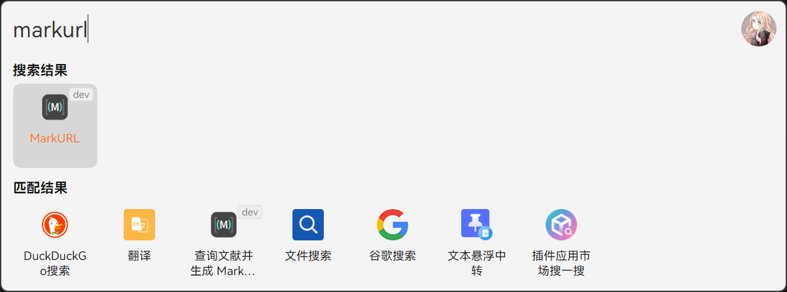

<p align="center">
  
</p>

<h1 align="center">MarkURL</h1>

<p align="center">
  uTools 插件：把任意 URL 一键转成 Markdown 引用并复制到剪贴板。
  <br />
  <a href="./README.md">English</a> ·
  <a href="./README.zh-CN.md"><strong>简体中文</strong></a>
</p>

<p align="center">
  
  
  
  
  
</p>

> 姊妹项目：[ruokee/markurl](https://github.com/ruokee/markurl) —— **YorkSu** 编写的 Python CLI 原版。
> 两个项目共享同一套"责任链 handler"设计哲学，但**代码完全独立**，分别针对各自的运行时（Python/requests vs TS/原生 fetch）做了调优。

这是一个**无 UI 的模板插件**（`mode: "none"`）：选中文本或键入关键字，在 uTools 超级面板里点击对应操作，Markdown 引用就会自动复制到你的剪贴板——没有窗口、没有打扰。

## 安装

普通用户从 uTools 插件应用市场安装：

1. 打开 uTools，按主超级面板快捷键（Windows 默认 `Alt+Space`，macOS 默认 `⌥+Space`）唤起搜索框。
2. 输入 `插件应用市场`（或英文别名 `pluginmarket`），回车进入市场。
3. 搜索 **MarkURL**，点击 **获取** 即可。

也可以从本地 `.upx` 包安装（参见下方[构建 / 打包](#构建--打包)）：直接把 `.upx` 文件拖到 uTools 即可。

## 使用方式

三种触发方式：

- **选中** 任意 `http(s)://…` URL → 唤起超级面板（Windows 默认 `Ctrl+鼠标拖选`，macOS 默认 `⌘+鼠标拖选`）→ 选择 **「URL 转 Markdown」** → 自动复制。
- 在 uTools 搜索框 **键入** 关键字 `MarkURL` / `mu` / `URL转Markdown`，回车后粘贴 URL。
- **论文检索**：输入 `arxiv` / `论文搜索` / `查文献`，然后输入论文标题（4–256 字符）—— 自动查询 CrossRef 并返回最匹配条目的 Markdown。

成功后会出现一条简短的系统通知 `已复制 Markdown`。

## 截图

| 超级面板触发 | 复制成功通知 | 关键字触发 |
| --- | --- | --- |
|  |  |  |

## 技术栈

- TypeScript 5.9 + tsup 8 (esbuild) —— 把 `preload/index.ts` 打成单个 CJS 文件
- 零运行时依赖：原生 `fetch` + 正则解析 `<head>`
- pnpm 10 / Node 22+

## 功能

| code | 触发方式 | 行为 |
| --- | --- | --- |
| `url2md` | 关键字 `MarkURL` / `mu` / `URL转Markdown`，或**选中**任意 `http(s)://…` URL | 跑一遍 handler 链 → 复制 Python 风格的 Markdown |
| `arxiv2md` | 关键字 `arxiv` / `论文搜索` / `查文献`，或**选中**任意非 URL 文本（4–256 字符） | 按标题查 [CrossRef](https://api.crossref.org/) → 复制 Markdown |

### Handler 链（按顺序执行）

| # | handler | 命中规则 | 数据源 |
| --- | --- | --- | --- |
| 1 | `paper.arxiv` | `arxiv.org/abs/` / `pdf/` | arXiv Atom API |
| 2 | `paper.doi` | `doi.org/` / `doi:` | CrossRef REST API |
| 3 | `github.repo` | `github.com/{owner}/{repo}`（排除 `/settings` 等保留路径） | GitHub REST API |
| 4 | `video.youtube` | `youtube.com/watch` / `youtu.be/` / `embed` / `shorts` | YouTube oEmbed |
| 5 | `wiki.wikipedia` | `*.wikipedia.org/wiki/`（所有语种） | Wikipedia REST API |
| 6 | `video.bilibili` | `bilibili.com/video/BV…` / `b23.tv/…` | Bilibili 官方 JSON API（含短链 redirect） |
| 7 | `webpage` | 任意 `http(s)://`（兜底） | 原生 `fetch` + 正则解析 `<head>` |

所有 handler 优先走官方 API ——不爬虫、不依赖任何第三方 SDK。

### 输出格式

完全对齐 Python `markurl` 的 `fmt_basic` 模板：

```
**{type}:** [{title}]({url}), {source}{additional}
```

`{additional}` 按 `author` / `date` / `[PDF](pdf)` / `citations` 顺序拼接，**有则加、无则略**，以英文逗号分隔。

实际示例：

```
**Repo:** [microsoft/vscode](https://github.com/microsoft/vscode), GitHub, microsoft
**Paper:** [Mistral 7B](http://arxiv.org/abs/2310.06825v1), arXiv, Albert Q. Jiang, …, 2023-10-10
**Video:** [Rick Astley - Never Gonna Give You Up …](…), YouTube, Rick Astley
**Knowledge:** [机器学习](https://zh.wikipedia.org/wiki/机器学习), Wikipedia
**Page:** [Example Domain](https://example.com), example.com
```

## 开发

```powershell
pnpm install
pnpm dev          # tsup --watch，把 ./preload.js 直接产出到 plugin.json 同级
```

然后在 uTools 里：**开发者工具 → 新建项目 → 选中 [plugin.json](./plugin.json) → 接入开发**（参考[官方接入开发文档](https://www.u-tools.cn/docs/developer/basic/first-plugin.html)）。

uTools 是相对 manifest 所在目录解析 `preload` 字段的。因为 tsup 把 bundle 直接写到了项目根（`./preload.js`），**项目根本身就是开发期可运行的插件目录**——没有 `dist/` 这层间接。

请在 **开发者工具 → 应用开发 → 设置** 里打开 **「退出到后台立即结束运行」**，这样每次重入插件都会自动加载最新的 `tsup --watch` 产物。详见 [官方调试文档](https://www.u-tools.cn/docs/developer/basic/debug-plugin.html)。

由于 manifest 里没有 `main` 字段，uTools 把它识别为无 UI 模板插件，仅执行 `preload.js`。

## 构建 / 打包

```powershell
pnpm build
```

会把三个运行时文件归集到 `dist/`，供 uTools 的**打包**命令使用（遵循官方 [「将 dist 文件夹打包成插件应用」](https://www.u-tools.cn/docs/developer/information/file-structure.html) 推荐做法）：

```
dist/
├── plugin.json       # manifest（不含 main、不含 development）
├── preload.js        # ~15 KB，零运行时依赖
└── logo.png
```

然后在 uTools：**开发者工具 → 项目 → 打包**，把 `dist/` 设为项目根，输出 `.upx`。

## 项目结构

```
utools-markurl/
├── plugin.json                 # uTools manifest（mode: none 模板插件）
├── tsup.config.ts              # 打包 preload，outDir: '.'
├── tsconfig.json
├── logo.png                    # 256x256
├── preload.js                  # ⛔ 构建产物，已 .gitignore
├── preload/
│   └── index.ts                # window.exports = { url2md, arxiv2md }
├── src/
│   ├── core/                   # handler 抽象（责任链模式）
│   │   ├── types.ts            # InfoType 联合类型 + Info / Handler 接口
│   │   ├── manager.ts          # HandlerManager.use() 链式注册
│   │   ├── context.ts          # 带超时的 fetchText / fetchJson
│   │   └── format.ts           # 对齐 Python 的 Markdown 模板
│   └── handlers/
│       ├── index.ts            # defaultManager.use(...)
│       ├── paper.ts            # arXiv (Atom) + DOI / CrossRef
│       ├── github.ts           # GitHub REST API
│       ├── youtube.ts          # YouTube oEmbed
│       ├── wikipedia.ts        # Wikipedia REST API
│       ├── bilibili.ts         # Bilibili JSON API + b23.tv 短链
│       └── webpage.ts          # 兜底：正则提取 og:title / <title>
└── scripts/copy-plugin-assets.mjs  # 把根目录文件 stage 到 dist/ 用于打包
```

## 添加新 handler

```ts
// src/handlers/zhihu.ts
import { defineHandler } from '../core/manager'

export const zhihuArticle = defineHandler({
  name: 'zhihu.article',
  match: (url) => /zhuanlan\.zhihu\.com\/p\/\d+/.test(url),
  async fetch(url, { fetchText }) {
    const html = await fetchText(url)
    // ...用正则从 html 里抽 title / author...
    return { type: 'Article', title, author, url, source: '知乎' }
  },
})
```

然后在 [src/handlers/index.ts](./src/handlers/index.ts) 里注册——**必须在兜底的 `webpage` 之前**。

## Roadmap

- **v0.1（当前）**：无 UI、关键字 + 选中触发、7 个内置 handler、输出 1:1 对齐 Python `markurl`。
- **v0.2**：可选的设置 feature（独立 uTools feature + 一个迷你 HTML 页面），用于开关 handler / 自定义模板，通过 `utools.dbStorage` 持久化。增量增加，不动现有架构。
- **v1.0+**：用户自定义 handler（基于 `utools.dbStorage`）+ 更完善的设置编辑器。

## 更新日志

发布说明详见 [CHANGELOG.md](./CHANGELOG.md)（遵循 [Keep a Changelog](https://keepachangelog.com/en/1.1.0/) 格式）。

## License

[MIT](./LICENSE) © inscripoem
